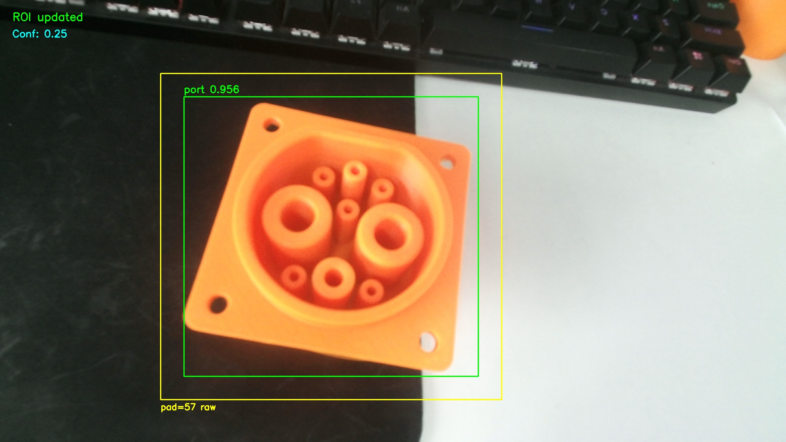
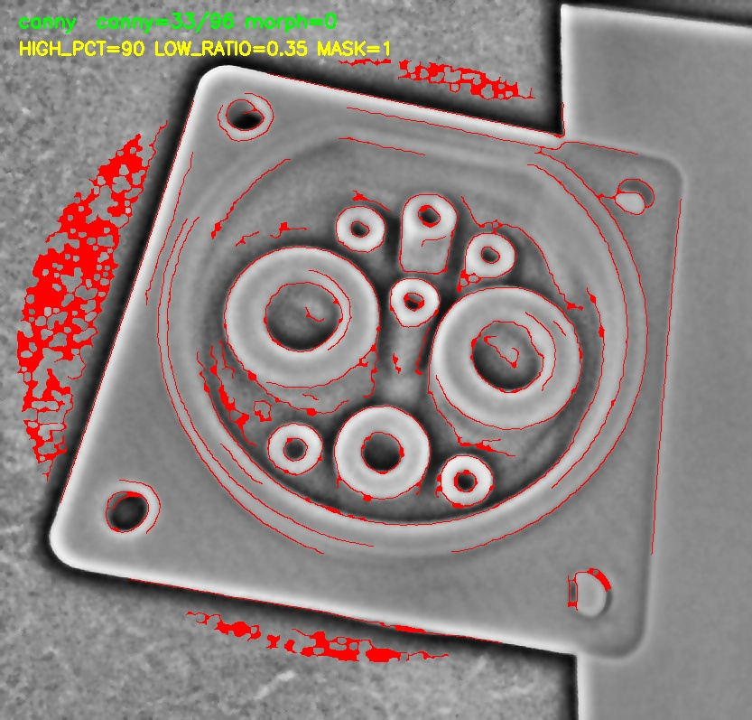
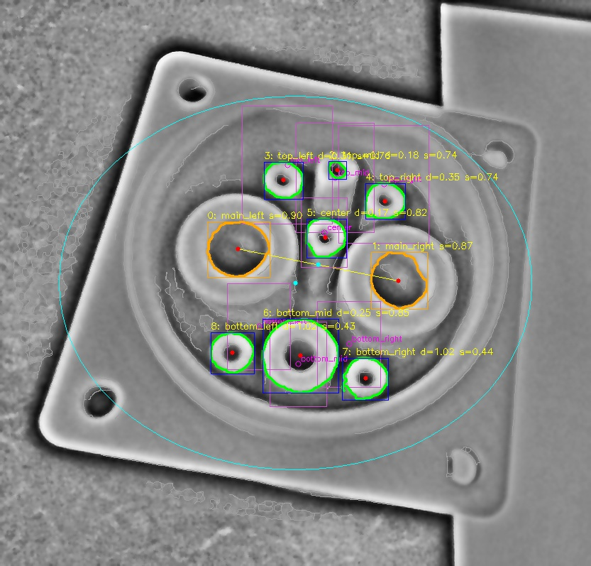
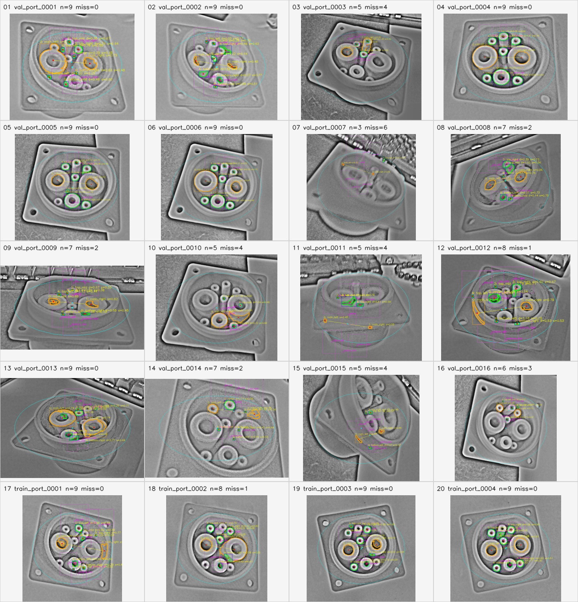
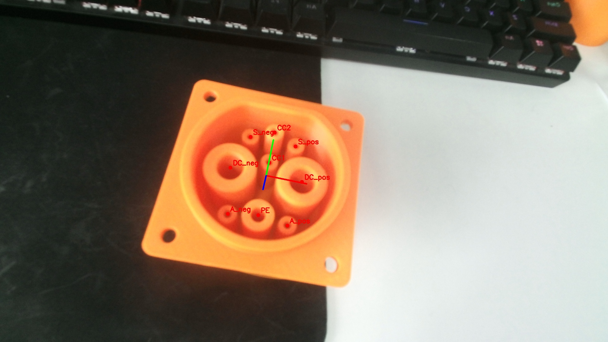
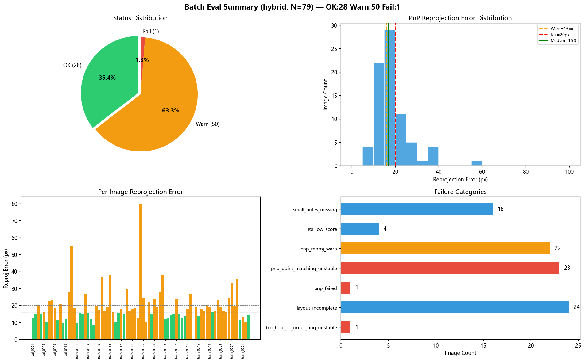

# robot-ev-charging

电动汽车充电口视觉检测与位姿估计项目。项目覆盖数据集整理、YOLO 充电口检测、ROI 后处理、孔位中心提取，以及面向机器人充电实验的 PnP 位姿估计。

## 效果概览

### YOLO 与 ROI 裁剪



实时 RGB 图像先经过 YOLO 检测充电口。绿色框是检测框，黄色框是加入 padding 后的 ROI，后续边缘和孔位检测都基于这个 ROI。

### 边缘提取



ROI 经过自适应增强后生成边缘图。当前边缘阶段使用自适应阈值和结构区域掩膜，尽量保留充电口内部孔位边缘，同时抑制外部背景边缘。

### 孔位候选点



轮廓会经过几何特征、重复中心距离和标准孔位布局先验筛选。最终保留的候选点会进一步做椭圆拟合，输出孔位中心。



### PnP 位姿结果



ROI 内的孔位中心会先映射回原始 1920x1080 图像坐标，再结合 RGB 相机内参和 3D 模型点求解 PnP 位姿。

## 项目结构

```text
robot-ev-charging/
├─ config/
│  ├─ camera_intrinsics.json
│  ├─ charging_port_model.csv
│  ├─ live_pipeline_config.json
│  └─ train_config.json
├─ train/
│  ├─ python/
│  │  ├─ convert_labelme_to_yolo_detect.py
│  │  ├─ check_yolo_dataset.py
│  │  └─ train_port.py
│  └─ cpp/
├─ live/
│  ├─ cpp/
│  │  ├─ kinect_live_capture_atomic.cpp
│  │  └─ read_kinect_intrinsics.cpp
│  └─ python/
│     ├─ launch_pipeline.py
│     ├─ roi.py
│     ├─ enhance.py
│     ├─ Canny.py
│     ├─ latest_candidate_contours.py
│     ├─ candidate_types.py
│     ├─ layout_prior.py
│     ├─ center_fit.py
│     ├─ pnp2.py
│     ├─ pipeline_quality.py
│     └─ post_vis_watch.py
├─ yolo_port/
│  ├─ images/train, images/val
│  ├─ labels/train, labels/val
│  └─ dataset.yaml
├─ dataset/live/        # 运行时输入输出，Git 忽略
├─ docs/
└─ runs/                # YOLO 训练输出，Git 忽略
```

## 环境准备

推荐环境：Windows、Python 3.9+。如果需要实时采集，需要安装 Microsoft Kinect SDK v2。

```powershell
python -m venv .yolo_env
.yolo_env\Scripts\activate
pip install -r requirements.txt
```

主要 Python 依赖：

- `ultralytics`
- `torch`
- `opencv-python`
- `numpy`

## 数据集与训练

Labelme 图片和标注文件放在：

```text
yolo_port/images/train
yolo_port/images/val
```

将 Labelme 标注转换为 YOLO 标签：

```powershell
.yolo_env\Scripts\python.exe train\python\convert_labelme_to_yolo_detect.py
```

检查 YOLO 数据集：

```powershell
.yolo_env\Scripts\python.exe train\python\check_yolo_dataset.py
```

训练检测模型：

```powershell
.yolo_env\Scripts\python.exe train\python\train_port.py
```

默认权重输出位置：

```text
runs/detect_retrain/weights/best.pt
```

## 实时流水线

启动完整实时流水线：

```powershell
.yolo_env\Scripts\python.exe live\python\launch_pipeline.py
```

流水线配置文件：

```text
config/live_pipeline_config.json
```

主要步骤：

1. `roi.py`
   检测充电口并裁剪带 padding 的 ROI。
2. `enhance.py`
   对 ROI 做自适应 gamma、光照归一化、受控 CLAHE、保边降噪和局部锐化。
3. `Canny.py`
   生成边缘图。`VISION_EDGE_METHOD` 可设置为 `canny`、`morph` 或 `hybrid`。
4. `latest_candidate_contours.py`
   筛选轮廓，应用孔位布局先验，拟合中心并导出中心数据。
5. `pnp2.py`
   将 ROI 坐标映射回原图坐标，并求解 PnP 位姿。
6. `pipeline_quality.py`
   输出 ROI、边缘、候选点和 PnP 的质量报告。

## 运行时输出

运行时文件写入 `dataset/live/`，该目录不会提交到 Git：

```text
latest.jpg                       # 采集到的 RGB 原图
latest_vis.jpg                   # YOLO/ROI 可视化
latest_roi.jpg                   # 裁剪后的 ROI
latest_roi_meta.json             # ROI 元数据和原图偏移
latest_roi_enhanced.jpg          # 增强后的 ROI
latest_roi_enhance_metrics.json  # 增强统计指标
latest_edges.jpg                 # 边缘图
latest_edges_vis.jpg             # 边缘叠加图
latest_candidate_contours.jpg    # 轮廓和布局可视化
latest_fitted_centers.jpg        # 拟合中心可视化
latest_fitted_centers.json       # 拟合中心数据
latest_pose.json                 # PnP 位姿结果
latest_pose_vis.jpg              # PnP 可视化
latest_pipeline_quality.json     # 流水线质量报告
```

## 质量报告

流水线产生输出后，可以运行：

```powershell
.yolo_env\Scripts\python.exe live\python\pipeline_quality.py
```

质量报告会检查：

- ROI 检测分数和裁剪尺寸
- 边缘密度
- 候选点数量、布局距离和拟合中心漂移
- PnP 重投影误差和相机内参状态

当前 79 张样张（hybrid 边缘模式）评估结果：

```text
OK: 29 (36.7%)   Warn: 49   Fail: 1
中位数重投影: 17.0 px
主要问题: layout_incomplete(24), pnp_point_matching_unstable(23)
```

## 批量评估

不要只用单张样例调参数。可以用批量评估脚本一次性跑 20-50 张原图，统计每张图的 ROI、边缘、候选孔位、布局完整性和 PnP 误差：

```powershell
.yolo_env\Scripts\python.exe live\python\batch_pipeline_eval.py --max-images 50
```

推荐使用 hybrid 边缘模式以获得更好的小孔召回率：

```powershell
$env:VISION_EDGE_METHOD='hybrid'
.yolo_env\Scripts\python.exe live\python\batch_pipeline_eval.py --max-images 50
```

默认输入目录：

```text
yolo_port/images/val
yolo_port/images/train
```

也可以指定自己的图片目录：

```powershell
.yolo_env\Scripts\python.exe live\python\batch_pipeline_eval.py --image-dir path\to\images --max-images 30
```



输出目录：

```text
artifacts/batch_eval/YYYYMMDD_HHMMSS/
├─ summary.csv
├─ failures.csv
└─ details.json
```

评估指标包括：

- 检出几个孔位候选
- 是否 9 个布局点齐全
- 缺失哪些 layout 点
- PnP 重投影误差
- PnP 内点数量
- 失败样例分类

当前失败分类包括：

- `roi_missing`：YOLO 没检出 ROI
- `roi_low_score`：ROI 检测置信度偏低
- `roi_suspicious_size`：ROI 尺寸比例异常
- `canny_too_sparse`：边缘过少
- `canny_too_noisy`：边缘过密
- `layout_incomplete`：9 点布局不完整
- `small_holes_missing`：小孔缺失
- `big_hole_or_outer_ring_unstable`：大孔或外圈粘连导致主孔不稳
- `pnp_failed`：PnP 无法求解
- `pnp_reproj_warn`：PnP 重投影误差偏高
- `pnp_point_matching_unstable`：PnP 点位匹配明显不稳

如果希望有失败样例时让命令返回非零退出码，可加：

```powershell
.yolo_env\Scripts\python.exe live\python\batch_pipeline_eval.py --strict-exit
```

## 相机内参

`config/camera_intrinsics.json` 当前使用 Kim et al. (2016) 的 Kinect v2 RGB 相机 1920x1080 标定值：

```text
fx = 1053.62, fy = 1047.51
cx = 950.39,  cy = 527.34
dist = [0.0042, -0.0019, -0.0038, -0.0026, 0.0]
```

来源：Kim et al. "Color and Depth Image Correspondence for Kinect v2", Springer LNEE vol.354。畸变模型为 OpenCV 标准 plumb_bob 5 参数模型。

这个配置仍标记为近似值，每台 Kinect v2 出厂参数略有差异。要获得可靠的绝对位姿，后续应替换为当前设备的实际棋盘格标定结果。

注意：PnP 使用的是原图坐标。ROI 内检测到的中心点会先映射回 1920x1080 原图坐标，再参与 PnP，因此 `camera_intrinsics.json` 必须对应原始 RGB 图像，而不是裁剪后的 ROI。

## Kinect 内参工具

`live/cpp/read_kinect_intrinsics.cpp` 可以通过 Microsoft Kinect SDK v2 读取 Kinect v2 深度相机内参：

```powershell
live\cpp\read_kinect_intrinsics.exe
```

深度相机内参不是 RGB 相机内参。当前 PnP 使用 RGB 图像点，所以不能把深度内参直接复制到 `camera_intrinsics.json`。

## 深度测试工具

`live/cpp/kinect_depth_probe.cpp` 是一个独立的深度链路冒烟测试工具，不改变当前 RGB/PnP 主流程。

```powershell
live\cpp\kinect_depth_probe.exe
```

如果 Kinect v2 已连接，工具会等待一帧深度图，并写入：

```text
dataset/live/latest_depth_status.json
```

报告中包含深度图尺寸、有效深度点数量、有效比例，以及深度的最小值、平均值和最大值，单位为毫米。如果未连接相机，工具会正常退出并写入 `status: no_frame`，因此可以安全用于离线测试。

## 常用命令

单独运行候选点提取和 PnP，且不阻塞 OpenCV 窗口：

```powershell
$env:VISION_PIPELINE_MODE='1'
.yolo_env\Scripts\python.exe live\python\latest_candidate_contours.py
.yolo_env\Scripts\python.exe live\python\pnp2.py
```

调试时手动保持窗口打开：

```powershell
$env:VISION_WAIT_FOR_KEY='1'
.yolo_env\Scripts\python.exe live\python\pnp2.py
```

语法检查：

```powershell
.yolo_env\Scripts\python.exe -m py_compile live\python\latest_candidate_contours.py live\python\layout_prior.py live\python\center_fit.py live\python\pnp2.py
```

## 已知限制

- RGB 相机内参仍需要替换为当前设备的真实标定结果。
- 当前验证主要基于已有 live 样张，新光照和新视角还需要继续测试。
- Kinect v2 深度数据适合作为距离校验或安全检查，目前不作为孔位中心检测的主输入。
- 部分历史源码注释仍有编码乱码，后续可以继续清理。

## Git 忽略策略

以下内容不提交：

- `dataset/live/`
- `artifacts/`
- `runs/`
- `*.pt`
- Python cache 和 YOLO cache
- C/C++ 编译产物，例如 `*.exe`、`*.obj`、`*.pdb`、`*.ilk`
